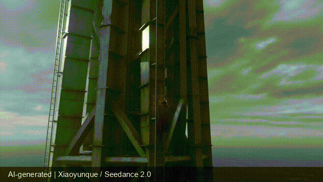

# ShotFlow

**Cinematic continuity for AI video — compiled from what actually happened.**

> Make the next AI shot remember the previous shot.

[中文说明](README.zh-CN.md) · [Examples](examples/) · [Skill](skills/shotflow/) · [Schemas](schemas/) · [Pro boundary](PRO.md)



## Evidence status

ShotFlow v0.1 Core is implemented and testable. Three real Seedance Clip 01
results have been accepted, observed, and hashed. The first controlled Clip 02
A/B pair was generated and blindly reviewed — and **the baseline won**. ShotFlow
v1 scored 83.34 average versus 100 for the baseline, so no improvement claim is
made. The failed result remains public evidence and drove a prompt-compiler
revision.

| Case | Role | Status |
| --- | --- | --- |
| The Sky Mender | flagship spectacle | Clip 02 v1 blind review lost; v2 VIP retry retained in Xiaoyunque queue |
| Storm Deck | physical action | earlier baseline ended without media; Gate 4 variants retained in Xiaoyunque queue |
| Obsidian Bloom | fictional product film | Gate 4 variants retained in Xiaoyunque queue |

All accepted originals are 1920×1080, 24fps, 5.125 seconds and retain the
provider's container-level `AIGC Label=1`. Public derivatives add a visible
disclosure. See the [blind review](examples/sky-mender/reviews/clip-02-blind-review-v1.md)
and [closed Gate 2 ledger](examples/GATE_2_APPROVAL.md).

The standard non-VIP `seedance2.0_direct` run stopped because that model rejects
`1080p`. Gate 4 then used the user-selected `seedance2.0_vision` VIP model at
`1080p`, but its first job returned no media because the account had
insufficient credits. The other four Xiaoyunque jobs were not submitted. The
user reports a daily credit refresh, so all five required successful outputs
remain in the Xiaoyunque queue. Google Flow is assigned additional portability
work and will be reported separately because its model, reference, and duration
contracts differ. See [Gate 4](examples/GATE_4_VIP_1080P_APPROVAL.md) and the
[Flow validation protocol](examples/GOOGLE_FLOW_VALIDATION.md).

## The problem

Most multi-shot AI video workflows write Clip 02 from the original plan. But Clip 01 rarely ends exactly as planned: a prop changes hands, a cape tears, the camera crosses the axis, or an unfinished motion lands somewhere unexpected.

ShotFlow makes the accepted output authoritative:

```text
plan Clip 01
    ↓
generate and accept a real result
    ↓
observe identity · props · space · motion · light · story
    ↓
diff planned vs observed
    ↓
compile Clip 02 from the real endpoint
    ↓
score the handoff
```

It is a workflow and evidence format, not another collection of cinematic adjectives.

## 60-second start

Requirements: Python 3.10+; no runtime dependencies.

```bash
git clone https://github.com/ruhang365/ruhang365-shotflow.git
cd ruhang365-shotflow
python3 -m pip install .

shotflow init my-sequence --title "My sequence"
shotflow --help
```

Run directly from a clone without installation:

```bash
python3 skills/shotflow/scripts/shotflow.py --help
```

Install the Skill in Codex:

```bash
mkdir -p ~/.codex/skills
cp -R skills/shotflow ~/.codex/skills/shotflow
```

Other directory-based agent hosts can use the same Skill folder, but their discovery path may differ.

## Core workflow

Plan the current shot from a JSON specification:

```bash
shotflow plan \
  --project my-sequence \
  --shot-id clip-01 \
  --beat "The cable catches before the fall resolves." \
  --spec clip-01-plan.json \
  --prompt clip-01.txt
```

After accepting a real result, place the media inside the project and record all six observation categories:

```bash
shotflow observe \
  --project my-sequence \
  --shot-id clip-01 \
  --state clip-01-observed.json \
  --media my-sequence/artifacts/clip-01.mp4 \
  --final-frame my-sequence/artifacts/clip-01-final.png

shotflow diff --project my-sequence --shot-id clip-01
```

Compile the next shot:

```bash
shotflow compile-next \
  --project my-sequence \
  --from-shot clip-01 \
  --next-shot clip-02-shotflow \
  --beat "The worker regains contact and seals the fissure." \
  --grammar clip-02-grammar.json \
  --contract-out clip-02-contract.json \
  --prompt-out clip-02-shotflow.txt
```

Score an accepted result:

```bash
shotflow score \
  --project my-sequence \
  --shot-id clip-02-shotflow \
  --evaluation clip-02-evaluation.json
```

## Public interfaces

- [`shotflow.project.json` v1](schemas/shotflow.project.schema.json) stores provider settings, entities, props, planned shots, observations, locks, artifact hashes, prompts, and evaluations.
- [`ObservationPatch` v1](schemas/observation-patch.schema.json) is the shared human/Core and future Pro analyzer output.
- [`Generation Attempt Ledger` v1](schemas/generation-attempt.schema.json) records every submitted, accepted, rejected, or failed run without private provider identifiers.
- Provider adapters describe portable settings. v0.1 marks only `seedance2.0_vision` as forward-tested.
- The five-axis grammar covers narrative moment, camera movement, light/color, space/composition, and material/physics.
- The six-dimension rubric covers identity, wardrobe/props, space, motion, light/material, and story beat.

Observed state always overrides planned state. Missing observations cannot produce a continuity-safe contract.

## Fair A/B protocol

For every case:

1. freeze the baseline Clip 02 prompt before Clip 01 generation;
2. generate and accept one Clip 01;
3. bind the real Clip 01 video and final frame;
4. give baseline and ShotFlow variants the same model, parameters, and references;
5. change only whether Clip 02 uses the accepted observation;
6. blind the variant labels during scoring.

ShotFlow will not claim improvement unless it wins a majority review in at least two of three cases and improves the average rubric score by at least 20 points.

During a real run, keep the public-safe attempt ledger current:

```bash
python3 tools/record_attempt.py \
  --case-dir examples/sky-mender \
  --variant clip-01 \
  --status submitted \
  --prompt examples/sky-mender/prompts/clip-01.txt
```

## Core and Pro

Core is complete for manual continuity work and stays local:

- project state and artifact hashes;
- five-axis shot planning;
- human ObservationPatch creation;
- diff, next-shot compilation, and scoring;
- generic provider interface and verified Seedance profile.

The future Pro beta may auto-read video and fill an ObservationPatch with timestamped evidence and confidence. It will not change the Core format or make Core projects dependent on a cloud account. Pro development starts only after 200 GitHub Stars or five real Core testers.

## Clean-room and rights

ShotFlow's code, prompts, grammar, examples, and workflow were written from scratch. [`zy-cinematic-realism`](https://github.com/popopo-99/zy-cinematic-realism) is acknowledged as prior art for structured cinematic prompt design, but its CC BY-NC files, director cards, text, code, and media are not included or adapted.

- Code, Skill, schemas, and templates: Apache-2.0.
- Original documentation and example media: CC BY 4.0 where copyright or related rights exist.
- Generated media must preserve required AI labels and provider marks.
- Ruhang365 names and marks are not licensed as trademarks.

See [Notices](NOTICE.md) and [Third-party notices](THIRD_PARTY_NOTICES.md).

## Contributing

Real output evidence matters more than an adapter name. Read [CONTRIBUTING.md](CONTRIBUTING.md) before proposing a provider adapter or showcase. Contributions use the Developer Certificate of Origin sign-off.

The 90-day target is 1,000 Stars, 20 external public works, and three code or adapter contributors. A community gallery opens only after three qualifying external works.
